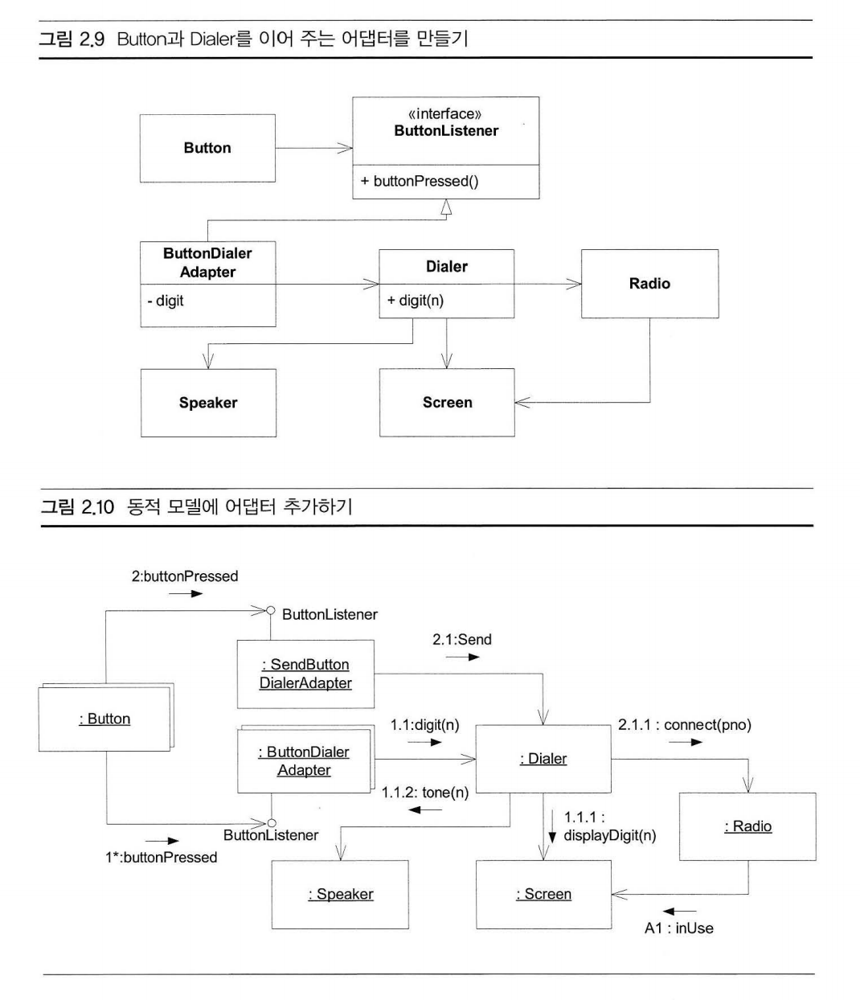

# Java-Practice

## (20.04.11) 제네릭 메서드 vs 와일드카드
- 기능적으로는 같다.
`결국 타입 파라미터를 선언하고 2회 이상 쓸 일이 없을 경우, 비록 구현이 번거롭더라도, 시그니처 단순화의 관점에서 타입 파라미터를 선언하지 않는 와일드카드가 유용하다고 볼 수 있지 않을까 합니다.`
출처 : https://www.slipp.net/questions/202#answer-860

### 제네릭 메서드와 와일드카드의 특징
- 타입 매개변수가 실체화되지 않는데, 예외적으로 제네릭 메서드와 와일드카드는 실체화 된다. (컴파일 이후로도 남아 있게 된다.)
- 실체화가 되기때문에 메소드 안에서 특정 인스턴스를 넣는걸 허용하지 않는다. 오로지 null만 넣을 수 있다.
예제코드 : package practice.generics.wildcard;

## (20.04.03) 추상클래스도 인스턴스화가 불가능하지 않다.
- 추상클래스라도 abstract 메서드를 모두 정의하여 반환한다면 인스턴스로써 사용가능하다.
- 예제코드 package practice.mylist;

## (20.03.31) map.merge -> map.put(key, map.getOrDefault)
- map.merge(key, 1, (integer2, integer1) -> integer + 1) 보다는
- map.put(key, map.getOrDefault(key, 0) + 1); 가 깔끔한거 같다.
    - 부과적으로 putIfAbsent 등이랑 적용해보는것도 괜찮을 듯

## (20.03.30) 참조타입 배열 clone()시 주의할점
- 그냥 쓰지말자..
- 참조는 바뀌지만 요소들은 같은 참조를 사용해서 넘겨준다. 그래서 복사된 배열에서 요소를 바뀌면 원본의 요소 값도 바뀐다.
- 예제코드 package practice.clone;

## (20.03.30) BigInteger 는 불변 클래스로써 연산시 계속 새로운 인스턴스를 만들어 낸다.
- 연산 메서드마다 자신이 변하는게 아니라, 새로운(new) BigInteger 인스턴스를 만들어낸다.
- 이러한 이유를 음수양수만 바뀌는 negate() 함수는 원본 함수와 '숫자값' int배열은 같은 참조를 사용해도 전혀 문제가 없다!
    - BigInteger는 부호를 나타내는 필드와 절대값을 나타내는 숫자배열 필드로 나누어져 있다.

## (20.03.26) hashCode()
- 해시코드를 재정의 하지 않으면 논리적으로 완전히 같은 객체라도 서로 다른 무작위 해시코드를 뱉어낸다. (재정의하지 않더라도 같은 해시코드 정도는 뱉어낼 것이라고 오해하고 있었다.)
- 예제코드 package practice.hashcode;

## (20.03.21) Stream Parallel()
- stream 만 사용하면 병렬처리가 자동으로 되는줄 알았는데 아니었다. parallel()을 사용해야 병렬처리가 된가.
- 사용하지 않으면 순차처리가 된다.
- 예제코드 practice.stream.parallel

## (20.03.13) Optional 바르게 쓰기
- Java Optional 바르게쓰기 (http://homoefficio.github.io/2019/10/03/Java-Optional-%EB%B0%94%EB%A5%B4%EA%B2%8C-%EC%93%B0%EA%B8%B0/)
- 명심해야할점은 **"Optional" 객체는 비싼 객체다. Optional을 쓰기앞서 분명한 이점을 가지고 있는가?** 를 생각해보자.

## (20.01.27) Arrays.asList에 대한 고찰
- Arrays.asList를 사용하여 iterator remove()를 실행시키면 익셉션이 난다.
- 분명 Arrays.asList()에서 반환은 new ArrayList()인데, 왜 ArrayList의 인스턴스가 아닐까?
-> 이름이 같아서 혼동된 건데, Arrays.asList()는 java.util.Arrays$ArrayList 컬렉션의 리스트는 java.util.ArrayList다!

## (20.01.26) 리스트(컬렉션)를 순환하면서 요소를 안전하게 삭제하는 방법
- 리스트(컬렉션)를 순회하면서 요소를 삭제하게되면 인덱스가 뒤틀리게 되어 문제가 발생한다. (그래서 PAT할때 인덱스를 거꾸로 삭제하는 편법을 쓴곤 했었다.)
이런 문제로 안전하게 삭제하기 위해서 iterator의 remove()를 사용하거나 Collection.removeIf() 메소드를 사용한다. 

### 1. iterator의 remove()
- iterator에서 최근에 next로 꺼낸 요소를 실제 리스트에서 삭제한다.
```
final Iterator<Integer> iterator = list.iterator();

while (iterator.hasNext()) {
    final Integer next = iterator.next();
    if (next % 2 == 0) {
    iterator.remove();
    }
}
```

### 2. Collection.removeIf()
- 이터레이터 생성없이 한줄로 끝! 내부적으로 같은 로직을 사용하고 삭제되었다면 불린값으로 true를 리턴한다.
```
list.removeIf(next -> next % 2 == 0);
```

## (19.12.28) Map.putIfAbsent()

### vs Map.computeIfAbsent()
- computeIfAbsent와 putIfAbsent는 유사한 기능을 하지만 차이점이 존재한다.

1. computeIfAbsent는 function을 갖지만, putIfAbsent는 값(value)를 갖는다. (putIfAbsent의 메소드를 할당하면 일단 메소드는 실행된다. 실행 이후에 put할지 말지를 결정한다.)
2. computeIfAbsent는 실행되는 동시에 반환값도 실행된 값을 반환하지만, putIfAbsent는 반환값이 null을 리턴한다.

- 연습예제 : MapComputeIfAbsentTest.class
- 그럼 putIfAbsent에 장점이 뭐야..?
    - A) 메소드를 할당 할 수 있다

### vs Map.getOrDefault()
- If your goal is only to retrieve the value, then use getOrDefault. Else, if you want to set the value when it does not exist, use putIfAbsent.
- 기본값만 반환받고자 한다면 getOrDefault()를 사용하고, 값을 설정하고 싶다면 putIfAbsent()를 사용하자.
    - (20.03.31)에 활용 예제 추가

- 참고 : https://stackoverflow.com/questions/48183999/what-is-the-difference-between-putifabsent-and-computeifabsent-in-java-8-map

## (19.12.17) Map.computeIfAbsent()
- Map.containsKey() + Map.get()이라고 생각하면 된다.
- 만약에 해당 키값이 존재한다면, 해당 밸류를 바로 가져온다. 하지만 존재하지 않는다면 두번쨰 인자로 들어간 람다식을 실행하고 그 값을 반환한다.

### 방법1. containsKey()를 사용한 ~~찐따같은~~ 방법
```
if(map.containsKey("siyoon")) {
    return map.get("siyoon");
} else {
    int length = s.length();
    map.put("siyoon", length);
    return map.get("siyoon");
}
```

### 방법2. computeIfAbsent()를 사용한 우아한 방법
```
return map.computeIfAbsent("siyoon", s -> s.length()); //키값의 길이를 밸류로 저장하는 함수식 바로 할당
```
- 위 아래의 코드는 같은 일을 한다.

- **Map을 다룰 때 containsKey() 사용한다면 다른방법이 없는지 생각해보자**


## (19.12.16) Map.merge
- 맵에서 해당 키값이 존재하지 않는 경우와, 이미 존재하는 경우를 한줄로 처리하는 메소드
```
public V merge(K key,
               V value,
               BiFunction<? super V,? super V,? extends V> remappingFunction) /* 기존 V,, 새로운 V, 반환 V */
```
- https://docs.oracle.com/javase/8/docs/api/
- 연습예제 : MapMerge.class

## (19.12.13) EnumSet(EnumMap)의 순서는 입력순서인가, Enum에 명시된 순서인가
- EnumSet(EnumMap)의 순서는 **Enum**에 명시된 순서다.
- 즉, 요일 Enum에 월화수목금토일 순서대로 Enum에 명시되어 있다면 어떤 순서로 입력되었던간에 월화수목금토일 순서로 나온다
- 연습예제 : EnumSetSequenceTest.class

## (19.12.06) 멘탈 모델
> "그동안 UX 실무자들에게 있어서 멘탈모델 이라는 말은, 기존의 UI는 사용자의 멘탈모델과 맞지 않는다는 식으로, **사용자가 생각하고 있는 무언가를 적당히 에둘러 말하기 좋은 용어**였다고 생각한다."
- "멘탈모델을 만든다는 것은, 사람들이 하는 행동에 대해 그들과 이야기하고, 패턴을 찾고, 그 패턴을 모두 포괄하는 하나의 모델로 정리하는 일이다."
- 멘탈모델을 사용하는 이유
  - 디자인의 자신감: 서비스와 기능을 설계하는 지침이 됩니다.
  - 방향의 명확성: 사용자와 사업 측면에서 올바른 의사결정을 내릴 수 있게 합니다.
  - 전략의 영속성: 비전과 사업 기회가 오래 지속되도록 해줍니다
  
- 결론적으로 도메인 주도 설계와도 비슷한 맥락을 가지고 있는 것이구나. 책 '도메인 주도 설계란 무엇인가?' 앞부분에서 말하는 것은 멘탈모델에 기반한 설계를 설명했던 것같다. 반면에 같은 도메인 주도 설계 책이라도 'DDD Start!'는 방법론에 초점을 맞춘 책이였다.

## (19.12.01) 모델, 모델링
- 모델이란 '대상을 단순화 해서 표현한 것'
- 모델은 복잡성의 바다에서 길을 잃지 않고 중요한 문제에 집중할 수 있도록 필요한 지식만 재구상 한 것이다.
- 모델은 복잡성을 관리하기 위해 사용하는 기본적인 도구다.
- 참고자료 (객체지향의 사실과 오해 6장 185쪽)

## (19.11.29) FACADE 패턴 (퍼사드 패턴)
- FACADE의 사전적 의미 : 1. (건물의) 정면 2. (실제와 다른) 표면, 허울
> 퍼사드는 클래스 라이브러리 같은 어떤 소프트웨어의 다른 커다란 코드 부분에 대한 간략화된 인터페이스를 제공하는 객체이다.

- 아래 Java 코드 예제는 사용자(you)가 퍼사드(컴퓨터)를 통해 컴퓨터 내부의 부품(CPU, HDD) 등을 접근한다는 내용의 추상적인 예제이다. (https://ko.wikipedia.org/wiki/퍼사드_패턴)
```
/* Complex parts */

class CPU {
	public void freeze() { ... }
	public void jump(long position) { ... }
	public void execute() { ... }
}

class Memory {
	public void load(long position, byte[] data) {
		...
	}
}

class HardDrive {
	public byte[] read(long lba, int size) {
		...
	}
}


class Computer {
	public void startComputer() {
        CPU cpu = new CPU();
        Memory memory = new Memory();
        HardDrive hardDrive = new HardDrive();
		cpu.freeze();
		memory.load(BOOT_ADDRESS, hardDrive.read(BOOT_SECTOR, SECTOR_SIZE));
		cpu.jump(BOOT_ADDRESS);
		cpu.execute();
	}
}

/* Client */

class You {
	public static void main(String[] args) throws ParseException {
		Computer facade = /* grab a facade instance */;
		facade.startComputer();
	}
}
```

- 외부의 클라이언트에게 복잡하게 사용되고 있는 클래스들을 추상적으로 제공하는 관문과도 같은 역할을 한다.
- Q 클래스 수준의 '캡슐화'라고 봐도 무리가 없을까?

## (19.11.19) 패키지(default) 접근제어자를 가지고 있는 클래스
- 패키지(default) 접근제어자를 가지고 있는 클래스는 한 뎁스 더 깊은 곳에서 접근이 불가능하다. 즉, 정말 같은 패키지 안에 존재해야만 접근 가능하다.
- 연습예제 : AccessModifierTest.java

/* Façade */
## (19.11.07) SRP - Single Responsibility Principle (단일 책임 원칙)
    '변경되어야 하는 이유가 오직 하나뿐이여야한다.'
쉽게 생각했지만 가장 중요한 '변경되어야 하는 이유'에 대해서 깊게 생각해보지 않았다.
클린아키텍처 p66에는 다음과 같이 설명했다. 

    '하나의 모듈은 하나의, 오직 하나의 액터에 대해서만 책임져야 한다.'

액터란 동일한 방식으로 변경되기를 원하는 사용자 혹은 이해관계자 집단을 말한다. (즉 사용자가 하나인경우도 있지만 여럿일 수도 있다.)
예를들어, '스마트폰' 이라는 객체를 철수와 영희가 모두 사용하고 있다고 가정해보자.   
철수는 스마트폰을 영상 시청을 위해서 사용한다. 하지만 영희는 스마트폰을 전화통화를 위해서 사용한다.

```
class 스마트폰 implements 동영상플레이어, 전화 {
    ...
}
```

위의 스마트폰을 같이 사용하는 철수와 영희는 다른 방식으로 변경되기를 원할 수 있기 때문에, 철수와 영희는 별개의 액터다. 즉 위의 스마트폰은 SRP를 준수하고 있지 않다.

철수가 만약 영상 시청을 위해서 스마트폰의 액정크기를 15인치로 바꾼다면? 영희의 전화통화 요구사항에는 맞지 않는 변경이 된다.
그러므로 해당 스마트폰의 역할을 토대로 2개의 클래스(객체)로 변경되어야 SRP를 준수한다고 볼 수 있다.

만약 철수와 영희가 같은 요구사항으로써 스마트폰을 사용한다면 철수와 영희는 하나의 액터로 볼 수 있고, 이러한 경우는 SRP를 준수한다고 볼 수 있다.

## (19.11.01) Null로 비교연산하면 NPE가 발생할까?
- 동일성(==)비교는 NPE가 발생하지 않는다.
- null == null은 true다.
- 동등성(equals)비교
    - myObject.equals(null); 은 NPE가 발생하지 않는다.
    - 만약 myObject가 null이면 NPE가 발생한다.

## (19.10.31) UML 실전에선 이것만 쓴다. 11장
### 객체지향의 과잉 (OOverKill)
- 하나님클래스만 조심할게 아니라, 허깨비 클래스도 조심해야 한다.
- 요구사항의 문제해결을 위해서 현실셰계와 클래스(객체)를 맹목적으로 1대1 매핑 시키지 말자. 어려운 도메인인 경우 이러한 설계가 나오겠지만 말랑말랑하게 생각하자.

### '연관'이란 메세지를 전달하기 위한 통로다.
11장에서 객체간의 연관을 '메시지'와 '알림'으로 계속해서 설명하고 있다. A라는 객체가 B라는 객체에게 무언갈 알려야 한다면, A->B의 연관관계가 나오는 것이다.
- "**연관은 객체들이 서로 메시지를 보내는 통도다.**" (p154)
- "따라서 UserInterface 객체가 제일 먼저 할 일은, ... **메시지를 보내** 준비가 되었는지 확인하는 일이다." (p155)
- "UserInterface 객체가 ... 시작(Start) **8메시지를 보내야 할 것이다.**" (p156)
- "따라서 ContainmentVessel은 HotWaterSource에 뜨거운 물을 그만 보내라고 **알릴 수 있어야 한다.**" (p157)


## (19.10.04) UML 실전에선 이것만 쓴다. 2장

- (22페이지~24페이지) ButtonDialerAdapter가 추가되어서 어떤 장점을 갖게 되었을까?
  1. ButtonDialerAdapter(이하 어댑터)가 없다면 Dialer가 어떤 Button들이 있고 어떤 기능과 매핑되어야 하는지 알고 있어야한다. (단일책임원칙 위반)
  2. 어댑터 없이 새로운 Button이 추가되어야 한다면 Dialer의 코드가 수정되어야 한다. (개방폐쇄원칙 위반)
  3. Button이 아니라 다른 방식으로 Dialer를 조작해야한다면, Dialer가 이에 대응 하는 코드가 삽입되어야 한다. 하지만 다른방식의 어댑터가 존재한다면 다이얼러의 수정없이 확장이 가능하다. (개방폐쇄원칙 준수)
- 연습 예제 : https://github.com/siyoon210/Java-Practice/tree/master/src/uml_for_java_programmers/p24_phone_exam
